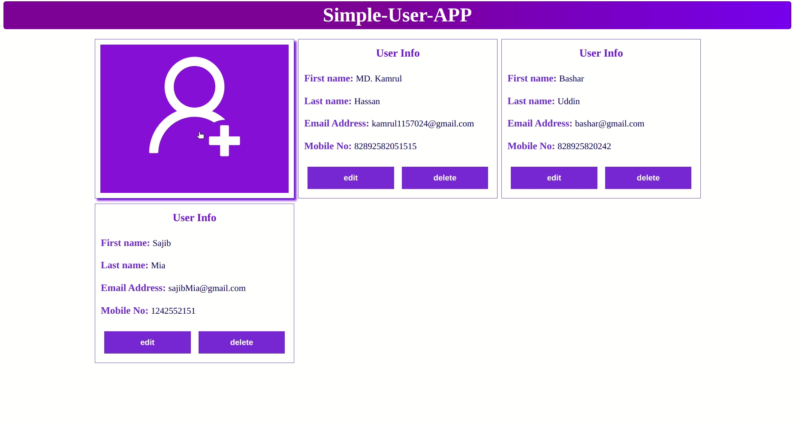

## A user management app 
## Using:
React, Flask, Docker, MySQL



## To Run:
```
git clone git@github.com:kamrul1157024/simple-user-app.git
```
For APPLE M1 Chip:
```
git checkout MAC-M1
```
Now up all of the services:
```
docker-compose up
```


